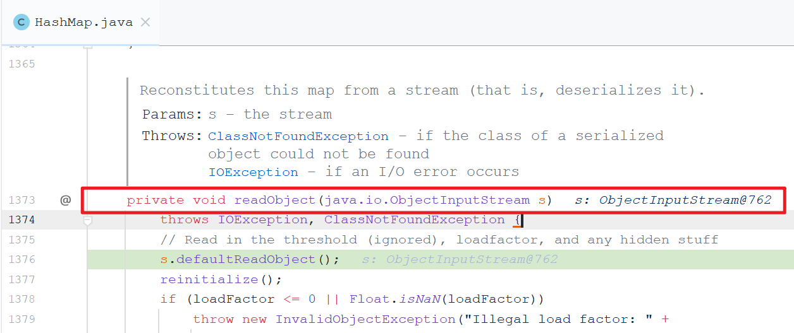
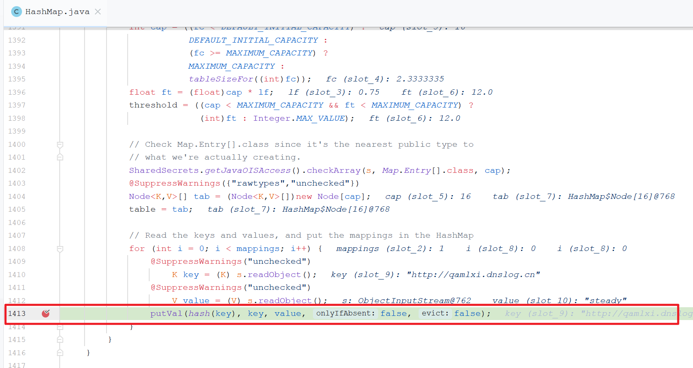
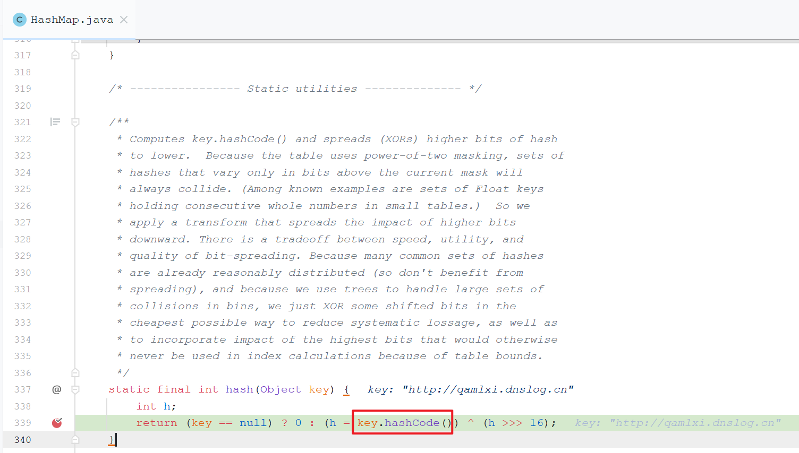
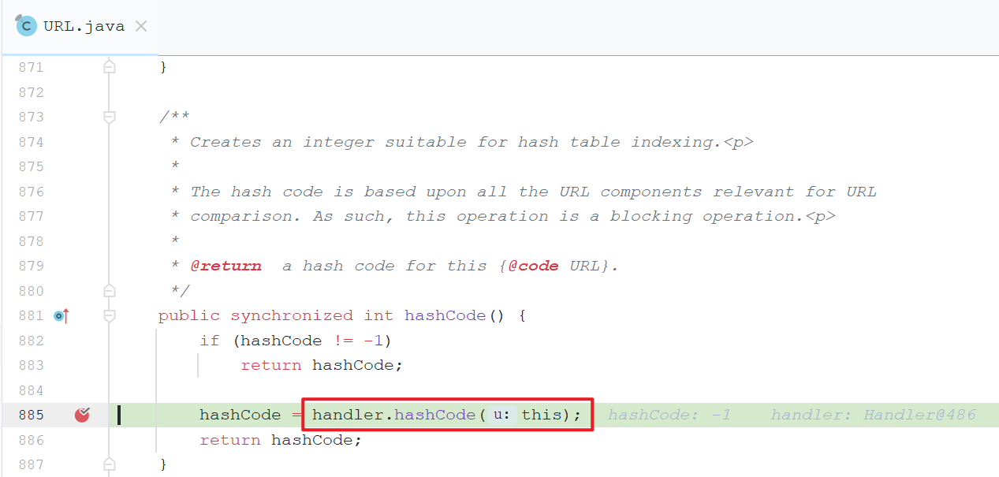
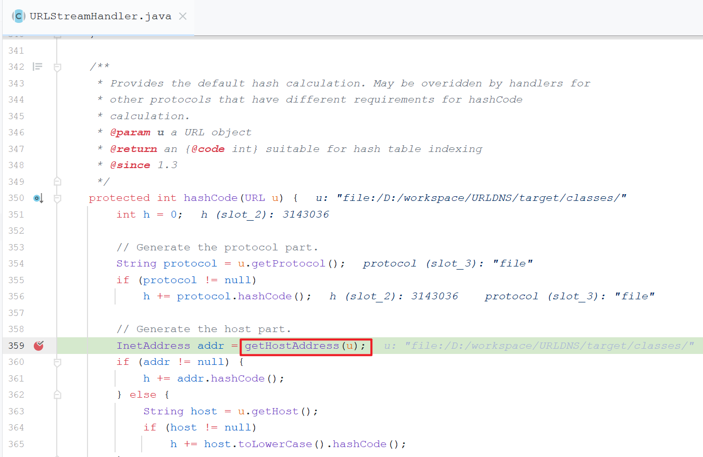
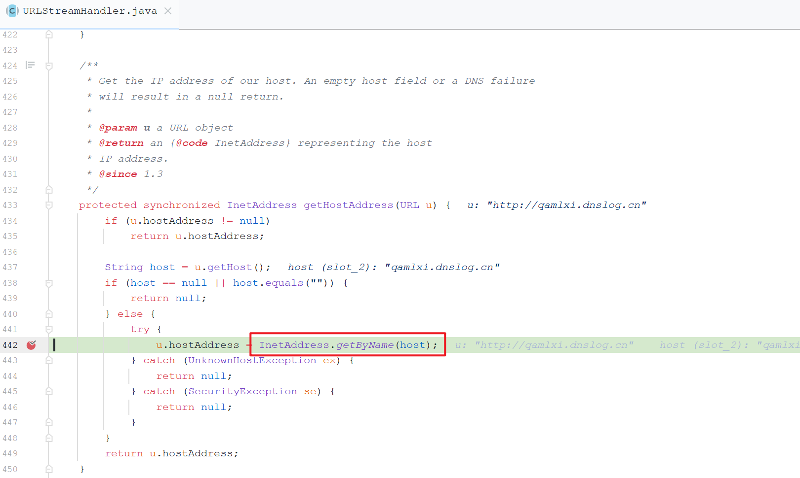
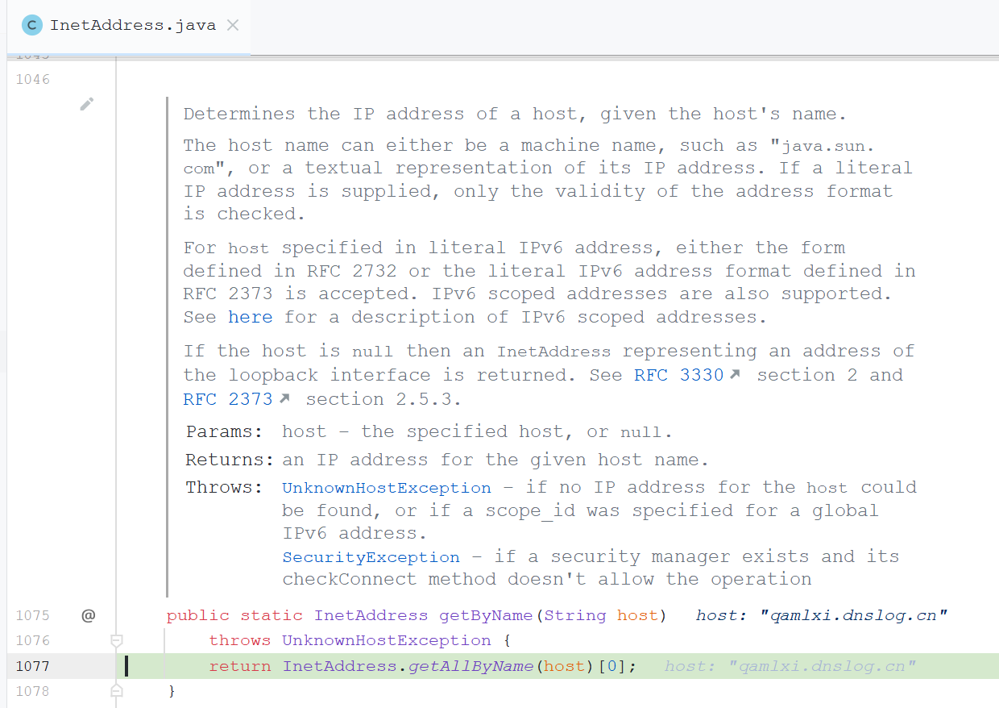
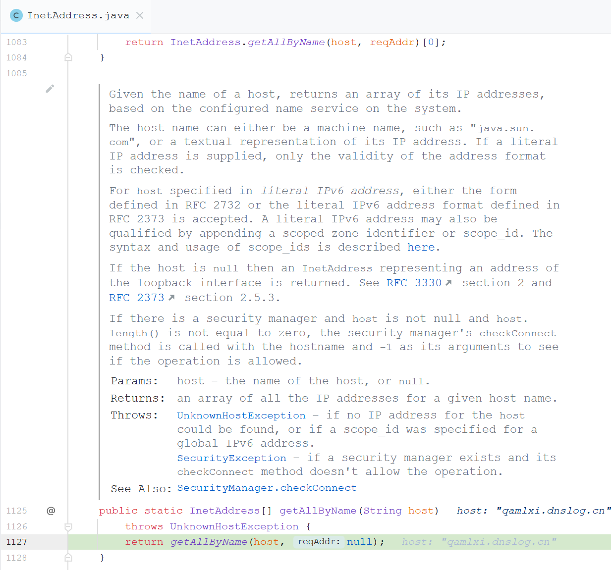
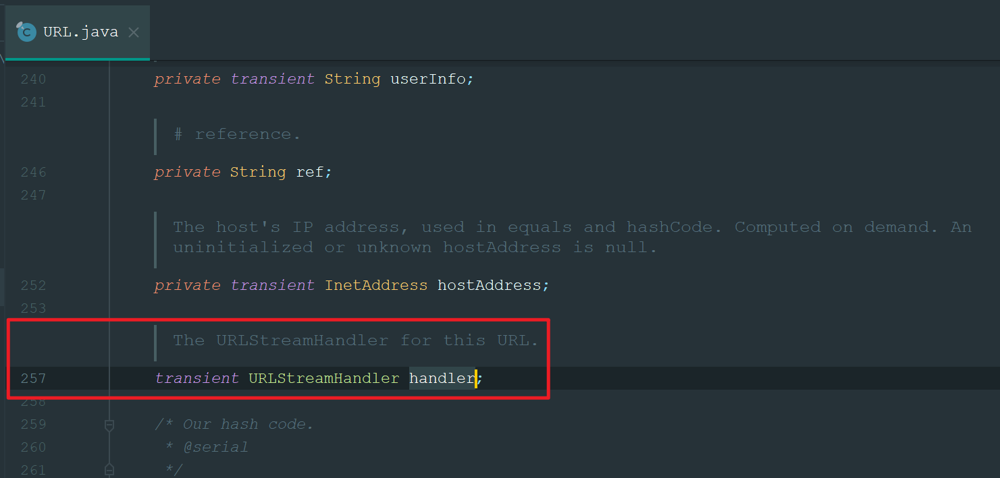

# URLDNS

作用： 

- 发起一次URL请求，而不是去执行命令
- 可用于测试是否存在反序列化漏洞（配合dnslog）
- 可在无回显的时候做验证外带数据

优点： 

- JDK自带的，不依赖第三方


Gadget Chain:

```text
HashMap.readObject(java.io.ObjectInputStream s)
    HashMap.putVal(int hash, K key, V value, boolean onlyIfAbsent,boolean evict)
        HashMap.hash(Object key)
            URL.hashcode()
```

下面以JDK 1.8为例跟踪一下调用链： 

进入HashMap的`readObject(java.io.ObjectInputStream s)`方法 



putVal的时候会调用`hash(key)`计算key的哈希： 



如果key不为空的话则会调用key的hashcode方法计算哈希值：



我们传递的key是URL类型，所以会进入URL的hashcode方法，这个计算hash值有个缓存，我们把断点打到第一次计算的时候：



它会调用handler的hashCode方法计算的hash值，handler的类型是URLStreamHandler： 

```java
    /**
     * The URLStreamHandler for this URL.
     */
    transient URLStreamHandler handler;
```

继续跟进去URLStreamHandler的hashCode方法，注意在这里调用了`getHostAddress(u)`，把我们作为key的URL传递了进去： 



继续跟进去`getHostAddress(u)`，在442行开始解析host了： 



让我们跟进去InetAddress的getByName看一下，从它的注释也能看出来它是负责做DNS解析的：



继续跟进去，是调用的自己的一个静态方法，因为同一个域名可能会返回多个地址： 




进行了SocketPermission权限的检查

```
SocketPermission
```


```
getAddressesFromNameService
```


# ysoserial的URLDNS链

代码地址： 

```
https://github.com/frohoff/ysoserial/blob/master/src/main/java/ysoserial/payloads/URLDNS.java
```


自己重写是为了避免生成的时候也进行一次DNS查询（因为payload要被序列化输出才能利用，而序列化的时候就会被执行一次，会造成一些误判等烦恼），而这个handler字段又是transient，序列化的时候会被忽略掉，所以对最终结果没有影响，妙啊：




疑问： 

有时候DNS log的域名解析到的地址会是127.0.0.1是什么原因呢？


